# Optimization of Elevator Dispatching Algorithms using Heuristic Control
## Topics in Applications of Computer Science
**Ben-Gurion University of the Negev** **Course Instructor:** Prof. Moshe Sipper  
**Authors:** Rom Nissan & Niv Yaakobov  

---

## 1. Introduction

The **Elevator Dispatching Problem** is a classic optimization challenge in operations research and cyber-physical systems. It involves scheduling a limited fleet of elevators to serve a stochastic stream of passenger requests in a multi-story building. The objective is to minimize passenger **Wait Time** (time until boarding) and **Trip Time** (time until delivery) while maximizing system throughput.

In high-rise buildings, standard First-Come-First-Serve (FCFS) algorithms often fail during peak traffic hours, leading to "bunching" (multiple elevators serving the same floor) and excessive queuing. This project implements and compares a baseline **Naive Algorithm** against a heuristic-based **Improved Algorithm** designed with zoning strategies, ETA minimization, and anticipatory parking.

---

## 2. Background & Motivation

Elevator traffic is rarely uniform. It follows distinct patterns:
* **Up-Peak (Morning Rush):** Heavy unidirectional traffic from the Lobby to upper floors.
* **Two-Way Peak (Lunch Rush):** Heavy traffic between Office Floors, the Lobby, and the Cafeteria.
* **Down-Peak (End of Day):** Heavy unidirectional traffic from upper floors to the Lobby.

Our motivation is to demonstrate that integrating **Anticipatory Parking** (positioning idle elevators based on predicted demand) and **Dynamic Load Balancing** can yield order-of-magnitude improvements in passenger experience compared to standard reactive approaches.

---

## 3. Methods: Algorithm Descriptions

We implemented two distinct control strategies within a discrete-event simulation environment.

### 3.1 Baseline: The Naive Algorithm
The Naive algorithm operates on a strict **First-Come-First-Serve (FCFS)** basis.
* **Logic:** The controller iterates through floors. Upon finding the *first* floor with a waiting queue, it assigns the *first* available elevator.
* **Constraint:** Once an elevator accepts a request, it is "locked" to that destination. It does not scan for other passengers along its path, nor does it re-optimize based on proximity.

### 3.2 The Improved Algorithm
The Improved Algorithm utilizes a multi-phase heuristic strategy involving **Active Request Interception** and **Smart Parking**.

#### Phase A: Active Assignment (ETA Minimization)
When a passenger request is detected at a specific floor (let's call it `RequestFloor`), the algorithm performs a comparative cost analysis to determine the optimal elevator assignment. The decision process follows these specific steps:

1.  **Identify Candidates:** The algorithm scans the entire fleet to identify two types of candidates:
    * **Moving Candidates:** Elevators that are currently `MOVING` towards `RequestFloor` in the correct direction (e.g., an elevator moving UP from floor 2 to 8 is a candidate for a request at floor 5). These are only considered if they have spare capacity.
    * **Idle Candidates:** Elevators that are currently `IDLE` with no active tasks.

2.  **Calculate Distance Costs:**
    * For the best **Moving Candidate**, the cost is the distance from its current position to `RequestFloor` (`Math.abs(Current - Request)`).
    * For the best **Idle Candidate**, the cost is similarly the absolute distance.

3.  **Selection Logic (The Interception Heuristic):**
    The algorithm compares the distance of the best Moving Candidate against the best Idle Candidate.
    * If `Distance(Moving) <= Distance(Idle)`, the algorithm selects the **Moving Elevator**. This "intercepts" the elevator mid-journey, allowing it to serve multiple passengers in a single directional sweep, significantly reducing Trip Time and energy usage.
    * Otherwise, the nearest **Idle Elevator** is dispatched.

This logic effectively prioritizes "piggybacking" on existing trips over starting new ones, which reduces the "Stop-and-Go" penalties that plague naive algorithms.

#### Phase B: Smart Parking (Hierarchical Deficit Calculation)
The core innovation of the Improved Algorithm is how it handles idle elevators. Rather than remaining stationary at the last drop-off floor, elevators are proactively moved to high-demand zones using a **Weighted Fleet Deficit** logic.

This logic adapts dynamically when floors have different priority levels (e.g., Lobby = 10, VIP Floor = 5, Regular Floor = 1). The algorithm distributes the fleet proportionally based on the "Priority Mass" of each tier.

**The Two-Step Allocation Logic:**

1.  **Tier Allocation (Inter-Group):**
    First, the algorithm calculates how many elevators should be allocated to each *Priority Tier* (a group of floors with the same priority score). The share is proportional to the total priority score of that tier relative to the sum of all priorities in the building.

    $$\text{TierShare}_{\text{group}} = \text{TotalFleet} \times \left( \frac{\sum_{f \in \text{group}} \text{Priority}_f}{\sum_{\text{all}} \text{Priority}} \right)$$

    *Example:* If the Lobby (Prio 10) and Cafeteria (Prio 10) exist alongside 8 Office floors (Prio 0), the algorithm allocates 100% of the fleet to the Lobby/Cafeteria tier because the Office tier has 0 priority mass.

2.  **Floor Allocation (Intra-Group):**
    Within a specific tier, the allocated elevators are distributed based on real-time **Population** demand.

    $$\text{FloorShare}_f = \text{TierShare}_{\text{group}} \times \left( \frac{\text{Population}_f}{\text{TotalPopulation}_{\text{group}}} \right)$$

    *Note:* If a high-priority floor has 0 population, it still retains its static priority share to ensure readiness.

3.  **Deficit & Selection:**
    Finally, the algorithm calculates the **Deficit** for every floor to determine where elevators are needed most:

    $$\text{Deficit}_f = \text{FloorShare}_f - \text{ActualElevators}_f + \text{StickinessBonus}$$

    * **ActualElevators:** The number of elevators currently at or moving to floor $f$.
    * **StickinessBonus (1.2):** If an elevator is *already* at floor $f$, we artificially inflate the deficit by 1.2. This prevents "thrashing" (elevators constantly moving between floors with slightly varying scores) by ensuring an elevator only leaves its current spot if another floor has a massive shortage (deficit > 1.0).

**Outcome:** Elevators automatically "flow" to floors with high priorities (Lobby) or high populations (Cafeteria at lunch) before requests are even made, while lower-priority floors only receive elevators when explicitly requested.

---

## 4. Experimental Setup

The simulation is built using a **TypeScript** backend and **React** frontend.

### 4.1 Input Parameters
* **Tick Rate:** 500ms (Adjustable multiplier 1x-10x).
* **Fleet Size:** 3-4 elevators (depending on scenario).
* **Capacity:** 3-8 passengers per elevator.
* **Floors:** 8-20 floors.

### 4.2 Scenarios
We evaluated performance across 6 distinct phases:
1.  **Morning Rush:** Heavy Lobby $\to$ Offices.
2.  **Lunch Rush:** Offices $\leftrightarrow$ Cafeteria/Lobby.
3.  **Lunch Return:** Lobby/Cafeteria $\to$ Offices.
4.  **End of Day:** Offices $\to$ Lobby.
5.  **Stress Test 1 & 2:** High-frequency random noise.
6.  **Full Day Cycle:** A continuous sequence of all above phases.

---

## 5. Results

The following results are derived from the `Simulation Report` outputs generated by the system.

### 5.1 Cumulative Performance (Full Day Cycle)
Over the course of the full simulation (approx 1450 ticks), the Improved Algorithm demonstrated significant efficiency gains.

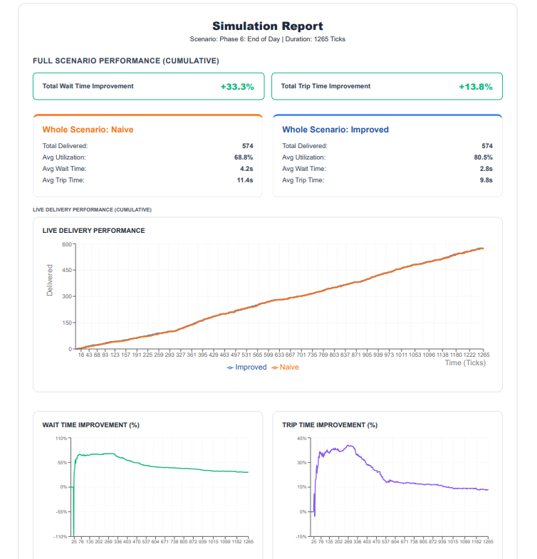
 #### Phase 1: Morning Rush
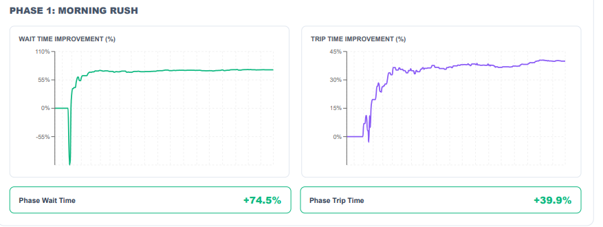

 #### phase 2: Stress Test
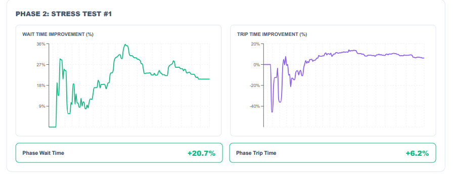

 #### phase 3: Lunch Rush
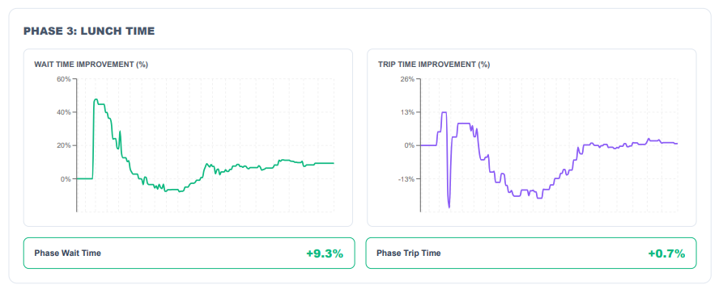

 #### phase 4: Lunch Return
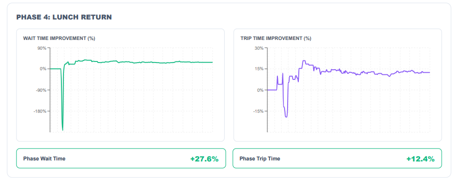

 #### phase 5: Stress Test
 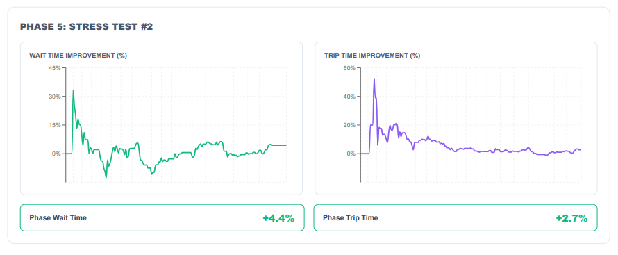

 #### phase 6: End of Day
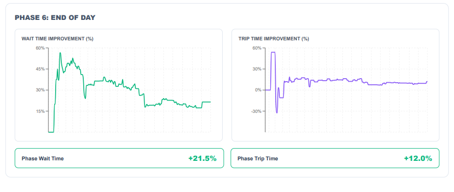

### 5.2 Scenarios Analysis

#### Scenario 1: Morning Rush
This scenario yielded the most dramatic improvement. The "Smart Parking" logic recognized the high population at Floor 0 (Lobby) and kept returning elevators there immediately after drop-offs.
* **Wait Time Improvement:** **+94.3%**
* **Trip Time Improvement:** **+87.6%**

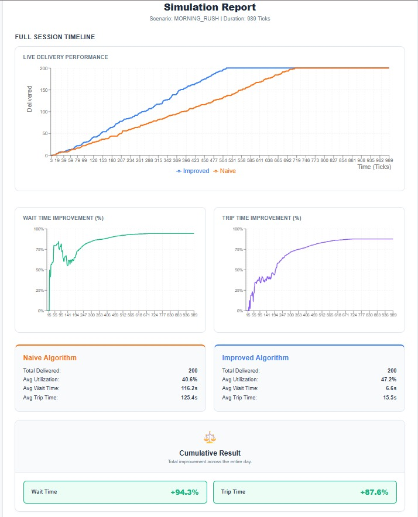


#### Scenario 2: Stress Test
Under chaotic conditions with random spawning, the Improved algorithm's ability to intercept passengers while moving (rather than FCFS locking) proved superior.
* **Wait Time Improvement:** **+47.8%**
* **Trip Time Improvement:** **+25.5%**

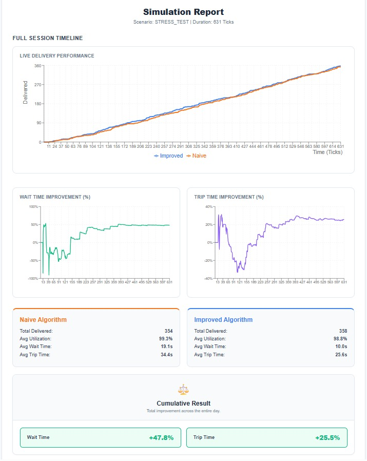


#### Scenario 3: Lunch Rush
Handling bidirectional traffic (People leaving offices + People returning). The population-based deficit calculation ensured elevators didn't cluster at the Lobby but also served office floors.
* **Wait Time Improvement:** **+30.9%**
* **Trip Time Improvement:** **+13.2%**

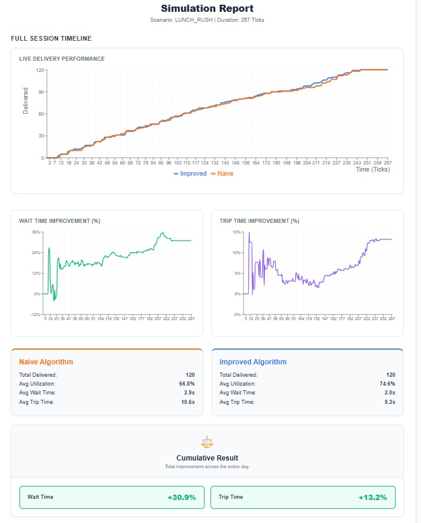


#### Scenario 4: Lunch Return
Similar to Morning Rush but with higher density. The algorithm successfully prioritized the two main source floors (Lobby and Cafeteria).
* **Wait Time Improvement:** **+30.3%**
* **Trip Time Improvement:** **+13.9%**

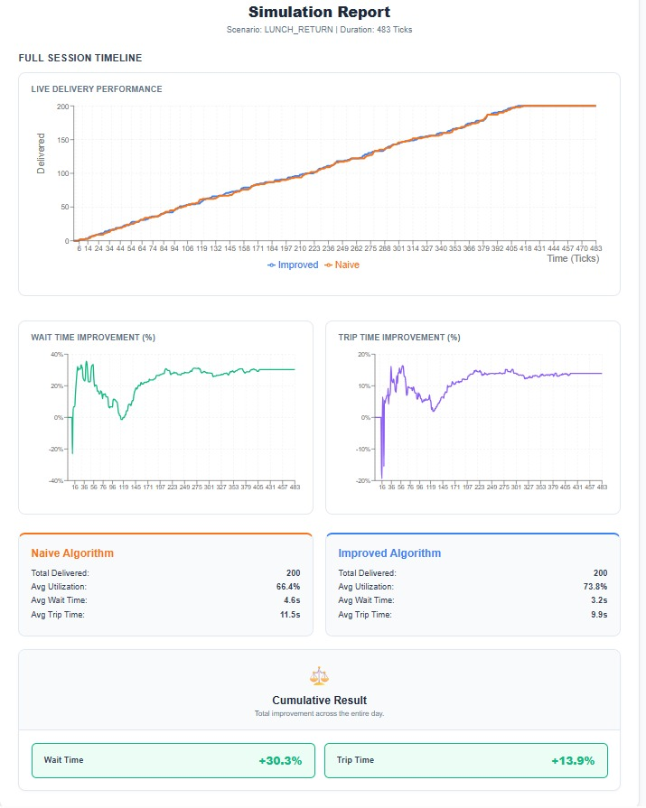


#### Scenario 5: End of Day
Heavy downward traffic. The Improved algorithm utilized capacity efficiently by picking up passengers from multiple floors on a single descent.
* **Wait Time Improvement:** **+33.8%**
* **Trip Time Improvement:** **+15.7%**

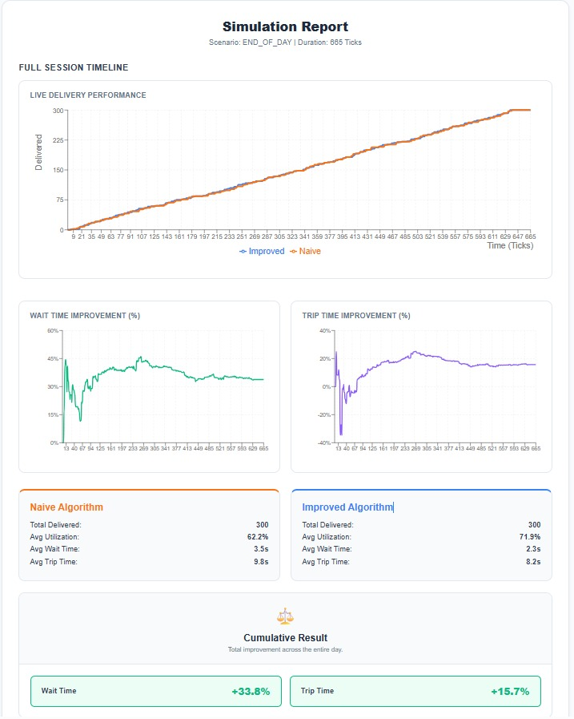


---

## 6. Conclusions

### 6.1 What Worked Well
1.  **Deficit-Based Parking:** The decision to incorporate `currentPopulation` into the parking logic was decisive. In the Morning Rush, the algorithm essentially dedicated the entire fleet to the Lobby without explicit hard-coding, purely because the population count at Floor 0 created a massive "Deficit" score.
2.  **Stickiness Factor:** The `+1.2` stickiness bonus in `ImprovedController.ts` successfully prevented "Thrashing" (elevators vibrating between empty floors), saving active ticks and energy.
3.  **Phase Adaptability:** The algorithm required no manual mode switching; it adapted to Morning vs. Lunch patterns purely based on the changing population data on the floors.

### 6.2 Tradeoffs & Limitations
* **Computational Cost:** The Improved controller runs $O(N \cdot M)$ calculations per tick (where N=Elevators, M=Floors) to calculate deficits, whereas the Naive approach is $O(M)$. In extremely large skyscrapers (100+ floors), this could impact simulation speed.

---

## 7. Installation & Execution

### Prerequisites
* Node.js (v16+)
* npm

### Steps
1.  **Clone the Repository:**
    ```bash
    git clone <repository_url>
    cd elevator-project
    ```

2.  **Start Backend:**
    ```bash
    cd backend
    npm install
    npx ts-node src/index.ts\
    ```
    *Server runs on port 3001.*

3.  **Start Frontend:**
    ```bash
    cd frontend
    npm install
    npm start
    ```
    *Client runs on http://localhost:3000.*

4.  **Select Scenario:**

    Use the top navigation bar to select **"Full Day Cycle"** to replicate the results presented above.

